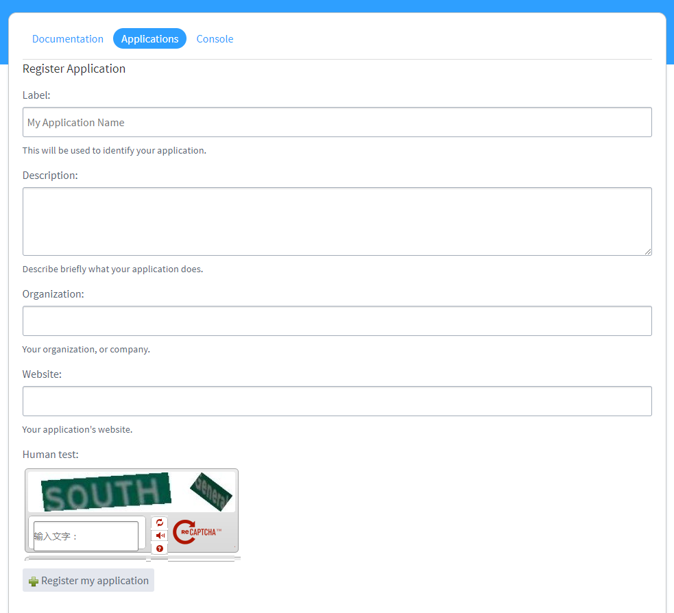
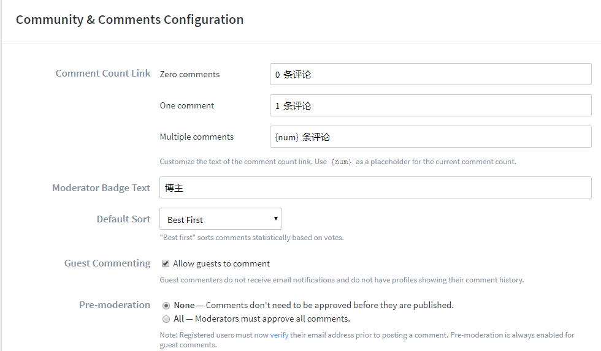

# gfw-disqus
ghost博客使用的评论框，主要封装代理disqus的API。

## 1. 运行环境

程序后端使用nodejs搭建，如果非ghost博客系统需要另行安装nodejs。部署服务器需要可以访问disqus官网，并且需要提供公网IP，推荐绑定单独的二级域名，如：

```
http://disqus.wangzhechao.com
```

## 2. 安装方法

将程序安装包上传到服务器，在程序解压目录下，运行npm安装依赖：

```
npm install
```

启动程序：

```
node index.js
```

如果长久运行，推荐和pm2配合使用。

## 3. 演示程序

当前功能支持发表和展示评论（推荐有能力重写前端）

演示地址：http://disqus.wangzhechao.com

## 4. 部署设置

部署该程序，需要设置三个地方，分别是disqus官网设置、前端加载设置以及后端程序设置。

###4.1 Disqus设置

访问API文档[页面](https://disqus.com/api/applications/)，创建应用：



成功后会获取一组值，包括：

```
API Key:

Nc7AR12BlsLGDJXlHBU4FAerFEriT4fcPb3RMJmdqBcqvc0n9XgfKXm9zjeEd2N6

API Secret:

tJjT8rXi0zixeXAyk4SS46HTsYikEZrVb1PCQuD4lZn7NQ0NL1hW2rfDGW2TSwU2

Access Token:

e01df6beb6413652ab026e3ne5tfce42
```

在Settings面板设置Domains（可选）：

```
wangzhechao.com
disqus.wangzhechao.com
```

设置权限为：

```
Read, Write, Manage Forums
```

保存即可。

接着开启匿名评论功能(Guest Commenting)，转到[Community & Comments Configuration](https://disqus.com/admin/settings/community/)页面。



###4.2  前端设置

如果是ghost博客默认主题：

```javascript
            <section class="post-full-comments">
                <div id="disqus_thread"></div>
                <script>
                    var disqus_config = function () {
                        this.page.title= '{{title}}';
                        this.page.url = '{{url absolute="true"}}';
                        this.page.identifier = 'ghost-{{comment_id}}';
                    };
                    var gfw_disqus_config = {
                        url: 'http://disqus.wangzhechao.com'
                    };
                    (function() {
                        var d = document, s = d.createElement('script');
                        s.src = gfw_disqus_config.url + '/embed.js';
                        s.setAttribute('data-timestamp', +new Date());
                        (d.head || d.body).appendChild(s);
                    })();
                </script>
            </section>
```

`gfw_disqus_config`对象设置url属性，该属性的值为程序部署服务器对外访问的域名或者ip地址。

### 4.3 后端设置

后端配置主要是`config.js`文件。

设置部分包括：

```javascript
module.exports = {
	server: {
		url: 'http://disqus.wangzhechao.com',		/* 指定该系统绑定域名（外网可访问） */
	    host: '127.0.0.1',
	    port: '3000',

	    compress: true,
	    proxy: true,
	    memoryStore: true
	},


	cookie: {
		secret: 'gfw-disqus',
		key: 'gfw-disqus-cookie'
	},


	disqus: {
		/* 管理员邮箱 */
		admin_email: 'wangzhechao@live.com',

		/* 管理员用户名 */
		admin_name: 'W_Z_C',

		/* disqus forum id */
		forum_id: 'wangzhechao',

		/* 授权网站 （跨域） */
		auth_website: '*',
		
		/* 公有key，为了提交匿名评论，无需修改 */
		pub_key: 'E8Uh5l5fHZ6gD8U3KycjAIAk46f68Zw7C6eW8WSjZvCLXebZ7p0r1yrYDrLilk2F',

		/* disqus授权 */
		api_key: 'Nc7AR12BlsLGDJXlHBU4FAerFEriT4fcPb3RMJmdqBcqvc0n9XgfKXm9zjeEd2N6',
		api_secret: 'tJjT8rXi0zixeXAyk4SS46HTsYikEZrVb1PCQuD4lZn7NQ0NL1hW2rfDGW2TSwU2',
		access_token: 'e01df6beb6413652ab026e3ne5tfce42',

		api_url: 'https://disqus.com/api',
		api_ver: '3.0',
		output_type: 'json',

		auto_approve: true	/* 是否自动授权 */
	},

	gravatar_cdn: '//cn.gravatar.com/avatar',

	logging: false
};
```

其中`url、admin_email、admin_name、forum_id、auth_website、api_key、api_secret、access_token`是必修项，其他暂时不用修改。

##5. 后端接口说明

目前后端有两个接口：

```
get /listPosts 获取评论列表
post /comment 提交评论
```

具体内容可以查看routes/index.js文件。